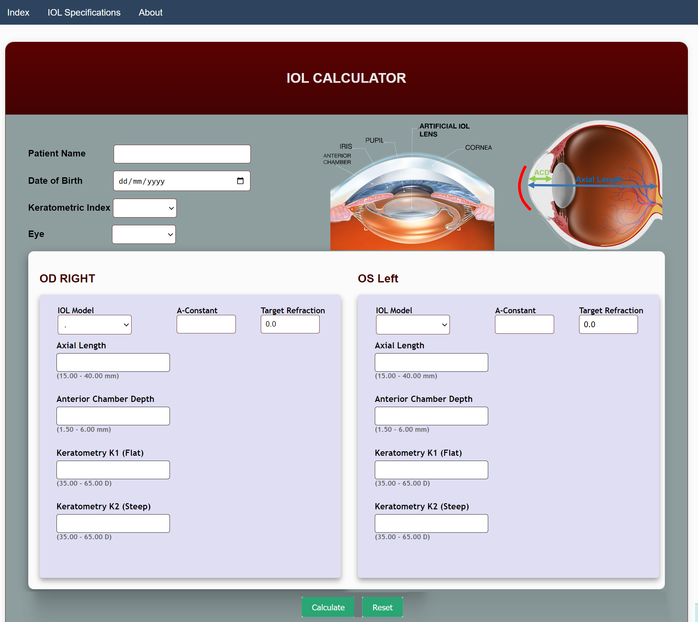
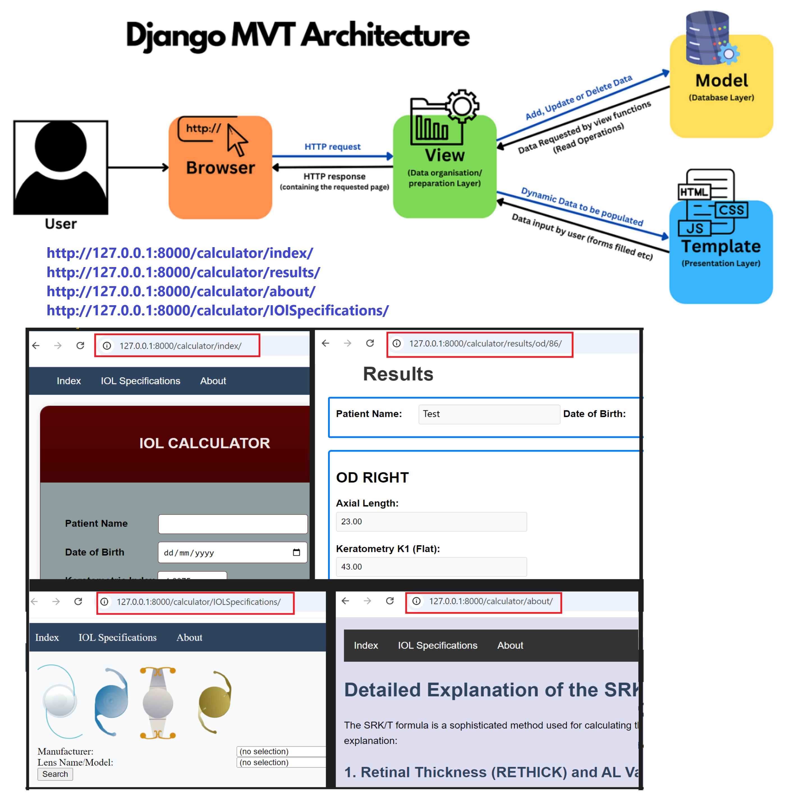

IOL-Berechnungsapplikation
==========================

Einleitung
----------

Diese Applikation ermöglicht die Berechnung der Intraocular Lens (IOL) für Patienten, die eine Kataraktoperation benötigen. Die Software erfasst biometrische Daten des Auges und bestimmt anhand dieser Daten die geeignete künstliche Linse.

---

Hauptfunktionen
---------------

### 1. **Biometrische Eingabe**

### 2. **Validierung und Fehlerbehandlung**

- Das System überprüft die Eingaben auf korrekte Wertebereiche und zeigt entsprechende Fehlermeldungen an.

### 3. **Ergebnisberechnung**

- Berechnung der erforderlichen **IOL-Power** und **Refraktion**.
- Ergebnisse werden übersichtlich dargestellt und können gespeichert oder bearbeitet werden.

---

Technische Details
------------------

### **Frontend:**

- **Technologien:** JavaScript, Bootstrap.
- **Framework:** Django für das Backend.
- **Datenbank:** PostgreSQL.

### **Backend:**

- Implementierung der **SRKT-II-Formel** für die Berechnung der IOL-Stärke.
- Verarbeitung von API-Daten von **iolcon.org** im XML-Format.
- Daten werden mithilfe von **Django-Modellen** gespeichert und verwaltet.

### **Model-View-Template (MVT) Pattern:**

- Die Applikation verwendet das MVT-Pattern:
  - **Model:** Definition der Datenmodelle und Speicherung in der Datenbank.
  - **View:** Logik für Benutzeranfragen und Berechnungen.
  - **Template:** HTML-Darstellung der Benutzeroberfläche.
  - 

---

API-Integration
---------------

Die Applikation nutzt die **iolcon.org API** zur Abrufung von Linsenspezifikationen:

- Daten werden als XML-Format abgerufen und verarbeitet.
- **ElementTree-Library** wird zur XML-Analyse verwendet.

